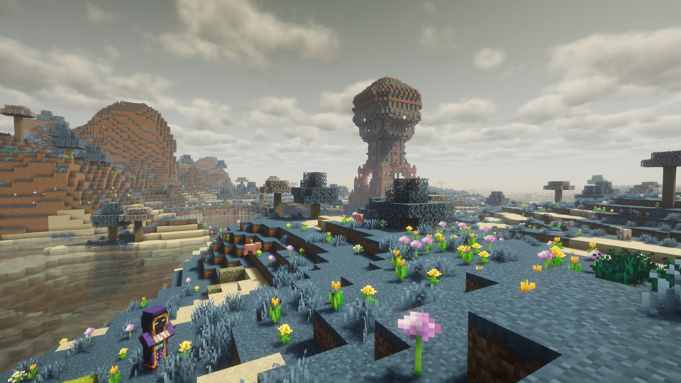

# Chrono Dawn

**Time-manipulation themed dimension mod for Minecraft**

A multi-loader Minecraft mod that adds a mysterious time-themed dimension called "Chrono Dawn" with custom portals, unique biomes, powerful bosses, and time-manipulating artifacts.



*More screenshots available on [CurseForge](https://www.curseforge.com/minecraft/mc-mods/chrono-dawn) and [Modrinth](https://modrinth.com/mod/chrono-dawn)*

## ⚠️ Important Notice for v0.3.0

**This version is NOT compatible with worlds created in v0.2.0 or earlier.**

Breaking changes in this release:
- **Portal System Rewrite**: Existing portals will not function. You must break and rebuild them using Time Hourglass.
- **Save Data Changes**: Boss defeat progress may be reset.

**Recommendation**: Back up your world before updating, or start a new world for v0.3.0.

See [CHANGELOG.md](CHANGELOG.md) for detailed information.

## Features

### Core Mechanics
- **Custom Dimension**: Explore Chrono Dawn, a dimension frozen in perpetual twilight
- **Portal System**: One-way portal travel using Time Hourglass, upgradeable to bidirectional with Portal Stabilizer
- **Time Distortion**: Hostile mobs move slower in Chrono Dawn dimension
- **8 Unique Biomes**: Forest, Desert, Mountain, Ocean, Snowy, Swamp, Dark Forest, and Ancient Forest

### Content
- **Custom Wood Type**: Time Wood trees with full block set (logs, planks, stairs, slabs, doors, etc.)
- **Major Structures**:
  - Ancient Ruins (Overworld spawn)
  - Forgotten Library (Chrono Dawn)
  - Guardian Vault (Chronos Warden boss)
  - Clockwork Depths (Clockwork Colossus boss)
  - Phantom Catacombs (Temporal Phantom boss)
  - Entropy Crypt (Entropy Keeper boss)
  - Master Clock (final dungeon with Time Tyrant boss)
- **Boss Enemies**:
  - Time Guardian (mini-boss, drops Master Clock Key)
  - Chronos Warden (mid-boss, drops Guardian Stone)
  - Clockwork Colossus (mid-boss, drops Colossus Gear)
  - Temporal Phantom (mid-boss, drops Phantom Essence)
  - Entropy Keeper (mid-boss, drops Entropy Core)
  - Time Tyrant (final boss)
- **Ultimate Artifacts**: Chronoblade (sword), Time Guardian's Mail (armor), Chrono Aegis (shield)

### Technical Features
- **Multi-Loader Architecture**: Supports both Fabric and NeoForge loaders
- **Architectury Framework**: Shared common code (80%) with loader-specific implementations (20%)
- **Custom Portal System**: Advanced portal mechanics with independent implementation
- **Performance Optimized**: Efficient entity tick handling and caching systems

## Requirements

### For Players
- **Minecraft**: Java Edition 1.21.1, 1.21.2, or 1.21.3
- **Mod Loader** (version depends on Minecraft version):
  - **For 1.21.1**: Fabric Loader 0.17.3+ with Fabric API 0.116.7+, OR NeoForge 21.1.209+
  - **For 1.21.2/1.21.3**: Fabric Loader 0.17.3+ with Fabric API, OR NeoForge 21.2.0-beta+/21.3.0-beta+
- **Dependencies**:
  - **Architectury API** 13.0.8+ (for 1.21.1) or 14.0.4+ (for 1.21.2/1.21.3)

### For Developers
- **Java Development Kit (JDK)**: 21 or higher
- **IDE**: IntelliJ IDEA (recommended) or Eclipse
- **Git**: For version control

## Building from Source

### Clone Repository

```bash
git clone https://github.com/ksoichiro/ChronoDawn.git
cd ChronoDawn
```

### Multi-Version Build Support

Chrono Dawn supports multiple Minecraft versions from the same codebase:
- **1.20.1**: Fabric only (legacy support) - *NeoForge requires Minecraft 1.20.5+*
- **1.21.1**: NeoForge/Fabric (stable)
- **1.21.2**: NeoForge/Fabric (current version, default)
- **1.21.3**: NeoForge/Fabric (uses 1.21.2 modules - hotfix release)

### Build for Specific Minecraft Version

#### Build for Minecraft 1.21.2 (Default)
```bash
# Shortcut command (recommended)
./gradlew build1_21_2

# Or explicit version
./gradlew build -Ptarget_mc_version=1.21.2
```

#### Build for Minecraft 1.21.1
```bash
# Shortcut command (recommended)
./gradlew build1_21_1

# Or explicit version
./gradlew build -Ptarget_mc_version=1.21.1
```

#### Build for Minecraft 1.20.1
```bash
# Shortcut command (recommended)
./gradlew build1_20_1

# Or explicit version
./gradlew build -Ptarget_mc_version=1.20.1
```

#### Build for Minecraft 1.21.3
```bash
# Shortcut command (recommended)
./gradlew build1_21_3

# Or explicit version
./gradlew build -Ptarget_mc_version=1.21.3
```

*Note: 1.21.3 is a hotfix release that uses the same modules as 1.21.2.*

#### Build for All Versions (Release)
```bash
# Build all release versions (1.20.1, 1.21.1, 1.21.2)
# Note: 1.21.3 is excluded - the 1.21.2 JAR is compatible with 1.21.3
./gradlew buildAll
```

**Output Files** (example for 1.21.2):
- `fabric-1.21.2/build/libs/chronodawn-0.5.0-beta+1.21.2-fabric.jar` - Fabric loader JAR
- `neoforge-1.21.2/build/libs/chronodawn-0.5.0-beta+1.21.2-neoforge.jar` - NeoForge loader JAR

### Build Specific Loader

#### Fabric Only
```bash
./gradlew :fabric:build -Ptarget_mc_version=1.21.2
```

#### NeoForge Only
```bash
./gradlew :neoforge:build -Ptarget_mc_version=1.21.2
```

## Development Setup

### Step 1: Import Project to IDE

#### IntelliJ IDEA (Recommended)
1. Open IntelliJ IDEA
2. File → Open → Select `build.gradle` in project root
3. Choose "Open as Project"
4. Wait for Gradle sync to complete

#### Eclipse
1. Open Eclipse
2. File → Import → Existing Gradle Project
3. Select project root directory
4. Click Finish

### Step 2: Run in Development Environment

#### Fabric Development Client
```bash
# Windows
gradlew.bat :fabric:runClient

# macOS/Linux
./gradlew :fabric:runClient
```

#### NeoForge Development Client
```bash
# Windows
gradlew.bat :neoforge:runClient

# macOS/Linux
./gradlew :neoforge:runClient
```

#### Development Server
```bash
# Fabric
./gradlew :fabric:runServer

# NeoForge
./gradlew :neoforge:runServer
```

### Step 3: Verify Setup

Launch the development client and verify:
- [ ] Minecraft starts successfully
- [ ] "Chrono Dawn" appears in mod list
- [ ] Creative inventory includes Chrono Dawn items
- [ ] World generation includes Ancient Ruins structures

## Testing

### Run All Tests
```bash
# Windows
gradlew.bat test

# macOS/Linux
./gradlew test
```

### Run Loader-Specific Tests
```bash
# Fabric tests
./gradlew :fabric:test

# NeoForge tests
./gradlew :neoforge:test
```

### Manual Testing Checklist

1. **Portal System**:
   - [ ] Find Ancient Ruins in Overworld
   - [ ] Craft Time Hourglass
   - [ ] Activate portal and travel to Chrono Dawn
   - [ ] Verify portal is one-way (stops working after entry)

2. **Dimension Features**:
   - [ ] Explore different biomes (Forest, Desert, Mountain, etc.)
   - [ ] Verify hostile mobs have Slowness IV effect
   - [ ] Find Forgotten Library structure

3. **Portal Stabilizer**:
   - [ ] Craft Portal Stabilizer in Chrono Dawn
   - [ ] Stabilize portal for bidirectional travel
   - [ ] Test round-trip travel Overworld ↔ Chrono Dawn

4. **Boss Battles**:
   - [ ] Defeat Time Guardian mini-boss
   - [ ] Explore Phantom Catacombs and defeat Temporal Phantom
   - [ ] Locate Master Clock structure
   - [ ] Defeat Time Tyrant final boss

## Installing Pre-built JAR

**⚠️ Important**: Version 0.3.0 is NOT compatible with v0.2.0 worlds. Back up your world or start a new one.

### For Fabric (Minecraft 1.21.2)
1. Install Minecraft 1.21.2
2. Install Fabric Loader 0.17.3+
3. Download and install Fabric API
4. Download and install Architectury API 14.0.4+
5. Copy `chronodawn-0.5.0-beta+1.21.2-fabric.jar` to `.minecraft/mods/` folder
6. Launch Minecraft with Fabric profile

### For NeoForge (Minecraft 1.21.2)
1. Install Minecraft 1.21.2
2. Install NeoForge 21.2.0-beta+
3. Download and install Architectury API 14.0.4+
4. Copy `chronodawn-0.5.0-beta+1.21.2-neoforge.jar` to `.minecraft/mods/` folder
5. Launch Minecraft with NeoForge profile

### For Minecraft 1.21.1
Use the same steps above, but with:
- Minecraft 1.21.1
- NeoForge 21.1.209+ or Fabric Loader 0.17.3+ with Fabric API 0.116.7+
- Architectury API 13.0.8+
- JAR files with `+1.21.1` in the filename

### For Minecraft 1.21.3
Use the same steps as 1.21.2 above. The 1.21.2 JAR files are compatible with Minecraft 1.21.3 (hotfix release).

**Note**: Download the correct version for your mod loader (Fabric or NeoForge).

## Project Structure

```
ChronoDawn/
├── common-shared/                   # Shared version-agnostic sources (included via srcDir)
├── common-gametest/                 # Shared gametest sources (included via srcDir)
├── common-1.20.1/                   # Common module for MC 1.20.1
├── common-1.21.1/                   # Common module for MC 1.21.1
├── common-1.21.2/                   # Common module for MC 1.21.2 (~80% of code)
│   ├── src/main/java/com/chronodawn/
│   │   ├── ChronoDawn.java          # Common entry point
│   │   ├── blocks/                  # Custom blocks
│   │   ├── items/                   # Custom items
│   │   ├── entities/                # Custom entities (bosses, mobs)
│   │   ├── worldgen/                # World generation features
│   │   └── registry/                # Registry wrappers
│   └── src/main/resources/
│       ├── data/chronodawn/         # Data packs (recipes, worldgen, structures)
│       └── assets/chronodawn/       # Assets (textures, models, sounds)
├── fabric-base/                     # Shared Fabric sources
├── fabric-1.20.1/                   # Fabric subproject for MC 1.20.1
├── fabric-1.21.1/                   # Fabric subproject for MC 1.21.1
├── fabric-1.21.2/                   # Fabric subproject for MC 1.21.2
├── neoforge-base/                   # Shared NeoForge sources
├── neoforge-1.21.1/                 # NeoForge subproject for MC 1.21.1
├── neoforge-1.21.2/                 # NeoForge subproject for MC 1.21.2
├── specs/chrono-dawn-mod/           # Design documents
├── build.gradle                     # Root build configuration (Groovy DSL)
├── settings.gradle                  # Multi-module settings
└── gradle.properties                # Version configuration
```

## Documentation

- **Feature Specification**: `specs/chrono-dawn-mod/spec.md`
- **Implementation Plan**: `specs/chrono-dawn-mod/plan.md`
- **Development Guide**: `specs/chrono-dawn-mod/quickstart.md`
- **Data Model**: `specs/chrono-dawn-mod/data-model.md`
- **Research Notes**: `specs/chrono-dawn-mod/research.md`

## Technical Notes

### Build Configuration
- **Build DSL**: Groovy DSL (for Architectury Loom 1.11-SNAPSHOT compatibility)
- **Mappings**: Mojang mappings (official Minecraft class names like `net.minecraft.core.Registry`)
- **Shadow Plugin**: Bundles common module into loader-specific JARs

### Mixin Configuration
- Fabric and NeoForge use **separate** Mixin configuration files
- **Fabric**: `chronodawn-fabric.mixins.json` (with refMap for Intermediary mappings)
- **NeoForge**: `chronodawn-neoforge.mixins.json` (without refMap for Mojang mappings)

See `CLAUDE.md` → "Mixin Configuration" section for details.

## Resources

### Official Documentation
- [Fabric Documentation](https://docs.fabricmc.net/)
- [NeoForge Documentation](https://docs.neoforged.net/)
- [Architectury Documentation](https://docs.architectury.dev/)
- [Minecraft Wiki](https://minecraft.wiki)

### Community
- [Fabric Discord](https://discord.gg/v6v4pMv)
- [NeoForge Discord](https://discord.neoforged.net/)
- [Architectury Discord](https://discord.gg/architectury)

## License

This project is licensed under the **GNU Lesser General Public License v3.0 (LGPL-3.0)**.

Copyright (C) 2025 Soichiro Kashima

See the [LICENSE](LICENSE) file for full license text.

## Credits

- Built with [Architectury](https://github.com/architectury/architectury-api)
## Support

For issues, feature requests, or questions:
- Open an issue on [GitHub Issues](https://github.com/ksoichiro/ChronoDawn/issues)
- Check existing documentation in `specs/chrono-dawn-mod/`

---

**Developed for Minecraft Java Edition 1.21.1 / 1.21.2 / 1.21.3**
